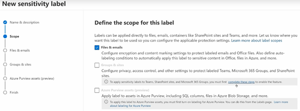
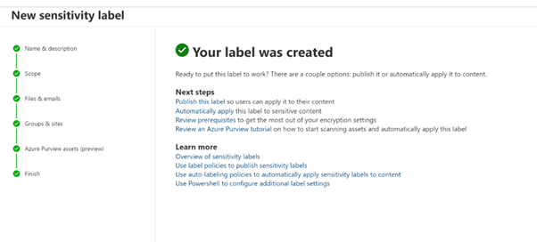

# Sensitivity-Labels
Create a sensitivity label called Business Sensitive. Auto Apply if US Bank account number is used.

<h2>Description</h2>
Project consists of a creating a Sensitivity Label. Use Sensitivity labels that you want to make available for apps and other services. Sensitivity labels from Microsoft Purview Information Protection let you classify and protect your organization's data, while making sure that user productivity and their ability to collaborate isn't hindered. In this practical, it is auto applying for sensitive data i.e. US Bank Account number.
<br />


<h2>Environments Used </h2>

- <b>Microsoft Purview Compliance Portal</b> 

<h2>Prerequisites</h2>

-<b> Sensitivity labels can be created or modified by anyone assigned the following roles:
 - Sensitivity Label Administrator
 - Compliance Data Administrator
 - Compliance Administrator
 - Security Administrator
 - Global Administrator
 </b>
- <b> Licenses: Microsoft 365 Enterprise E3 or E5 SKUs, or Microsoft 365 Business Premium SKU</b>


<h2>Program walk-through:</h2>

<h3>Steps: </h3>

1.  Go to Microsoft Purview portal --> go to Information Protection
2.	Create a label --> give name and description
3.	Define a scope --> mark the content of files
4.	Turn on Content marking --> add a watermark : name ‘Business sensitive’
5.	Turn on  auto-labeling --> select ‘Sensitivity info types’ as Content contains
6.	Select Sensitivity info types ‘’US Bank A/C number’’
7.	Add --> next --> create a label


<h3>Screenshots:</h3>

<p align="center">
Create a Sensitivity label: <br/>

<br />
<br />
Scope: <br/>

<br />
<br />
Protection settings: <br/>

<br />
<br />
Watermark: <br/>

<br />
<br />
Select Sensitivity info type: <br/>

<br />
<br />
Result: <br/>

<br />
<br />


</p>

<!--
 ```diff
- text in red
+ text in green
! text in orange
# text in gray
@@ text in purple (and bold)@@
```
--!>
